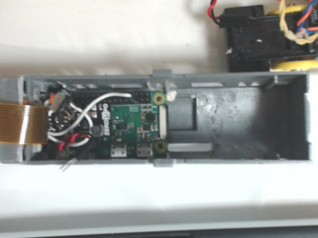
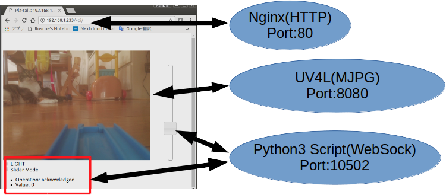

# Raspberry-Pi-Zero W 搭載プラレールについて
去年、Raspberry-Pi の発売と同時に[初代プラレール](https://github.com/Kumapapa2012/Raspberry-Pi-Zero-on-PLA-RAIL)を作成。
これは USB の　Web カメラ、Wifi Dongle などをつけるため、 USB ハブを接続していました。  

しかし今年、Raspberry-Pi Zero W を運よく入手でき、これをプラレールに搭載しました。  
Wifi-Dongle が不要になり、またRaspberry-pi Camera モジュールを使用することで、USB WebCam も不要になりました。  
さらに最近は Zero-LiPo という Lipo バッテリーをRaspberry Pi Zero で使用するためのパーツも販売されており、これも使用しました。  
その結果、なかなか完成度の高いプラレールができました。  
ここでは、作成方法と、動かすためのコードを公開します。  

# 材料
## プラレール S-61　E233系湘南色 (単二電池バージョン)
<http://www.takaratomy.co.jp/products/lineup/detail/plarail470663.html>  
単二電池バージョンのE233系です。  
最近のプラレールは単三電池バージョンが主流ですが、単二電池バージョンもまだ上記タカラトミーの公式サイトで販売しています。  
アマゾンなどでも購入可能と思われます。

## Raspberry Pi Zero W
<https://www.switch-science.com/catalog/3200/>  
技適の関係で、日本取り扱い店からの入手が必要ですが、2017/08 現在入手しづらい状況が続いています。

## Raspberry Pi Camera Module + Cable
<https://shop.pimoroni.com/products/raspberry-pi-camera-module-v2-1-with-mount>  
<https://shop.pimoroni.com/products/camera-cable-raspberry-pi-zero-edition>  
Raspberry Pi Zero に取り付けるカメラとケーブル。  
Zero のカメラコネクタは通常の Raspberry Pi とサイズが全く異なるため、専用ケーブルが必要です。  
最近、Zero 専用のカメラも出ましたので、こちらを使用するのもいいかもしれません。  
<https://shop.pimoroni.com/products/raspberry-pi-zero-camera-module>

## Zero Lipo
<https://www.switch-science.com/catalog/3216/>
Li-PoバッテリーをRaspberry Pi シリーズで使用できるようにする電源コンバーターです。  
なお、今回はバッテリーコネクタを切除し、カメラと干渉する部分を切断しています。

## Li-Po　バッテリー
<https://www.amazon.co.jp/gp/product/B01KC2JVB4/ref=oh_aui_detailpage_o04_s00?ie=UTF8&psc=1>  
Amazon で購入した、5個パック+充電器のセット。かなりコスパが良い。

## 電子部品
秋月電子さんや千石電商さんで購入。また、抵抗などは自宅にある適当なものを使用しています。  
以下の表にまとめます。

|種別|名称|備考|
|:-|:-|:-|
|モーターコントローラー|TA7291P|PWM によるモーター制御を行う|
|抵抗|R1|10kΩ - TA7291P の Vref-Vs間で、回路保護のため。|
|抵抗|R2|3.0Ω - Vs への入力電流の制限用|
|抵抗|R3|１kΩ - ヘッドランプ LED 用|
|LED|LED1,LED2|白色 LED ヘッドランプ用。|
|電解コンデンサ|C1|10V2200μF - 電圧降下の抑制用パスコン|
|コネクタ・ケーブル類|-|手持ちのものを使用|

## その他部品
バランス調整のため板おもりも使用しました。  
<https://www.amazon.co.jp/%E7%AC%AC%E4%B8%80%E7%B2%BE%E5%B7%A5-22170-%E6%9D%BF%E3%82%AA%E3%83%A2%E3%83%AA4m%E5%B7%BB%E3%82%AD-0-25mm/dp/B000AR6W00>

# 構造
モーター部とバッテリー部の2両で構成されています。
目測と手合わせだけで位置を決め、カッターやルーターでガリガリ切削して作っていますので図面等は存在しません。
このため、すべて写真で説明します。
※なお、以降の写真ではヘッドライトの LED が 1 つしかありません。これは先日結線が切れてしまい、外したためです。しかし以下の説明は、LED を2つ使うものとして記述します。

## 1 両目
Raspberry Pi Zero W とカメラ、モータードライバを搭載しています。カメラ画像は Motion JPEG ストリーミングしています。モータードライバでモーターの回転を制御します。  
  
シャーシとの分離。  
  
ケーブルを外したところ。  
  
カメラケーブルを外したところ。  
中心の右下横のスイッチ穴に干渉しないよう、 Raspberry Pi Zero をはめています。こうしないと、ギヤボックスとRaspberry Pi Zero が干渉し、ボディがシャーシに嵌まりません。  
  
SD カードの突起により、スイッチ穴との干渉が発生したため、穴を開けて対処しています。  
結果的に、すぐに SD カードを取り出せるようになっています。  
  
カメラの格納。運転席部分にすっぽりと収まります。  

上から見たところ。ケーブルを下部にすることで、ケーブルが Raspberry Pi Zero と干渉するのを避けています。  
  
レンズの穴の位置も、やはり手合わせで決めています。  
  
ボディ前方を大幅に切削したため運転席部分は保持できず、テープで止めています。  
  
シャーシです。ハンダ付けが非常に雑で恥ずかしいのですが、一応問題なく機能しています。  
  
モータードライバとパスコンです。ハンダ付けが非常に汚く、見苦しいと思いますがご容赦ください。  
配線の詳細は別途記載する配線図にてご確認ください。  
なおパスコンは動作の安定化のためつけています。容量は適当です。  
これがないと、発進時にカーネルパニックを起こしがちです。  
  
ギアボックスは 2 段階変速ですが、 1 段目のみ使用するようにストッパーを設けています。これはモータ負荷による起電力低下の緩和のためですが、そもそもブラウザでモーターの無段階変速を行いますので、ギアによる変速は無用です。  
  
単二電池仕様のプラレールですので、電池がない状態では前輪が浮くことがあります。  
それを防止するため、前方下部におもりをつけています。板おもりを丸めて作成しています。

## 2 両目
Li-Po バッテリーを搭載しています。特に改造していません。 

電池の充電は、車両ごと充電器に繋いで行います。

# ブレッドボード図/配線図
Fritzing で作成したブレッドボード図です。[Fritzing でも公開](http://fritzing.org/projects/raspberry-pi-zero-w-motor-control-with-zero-lipo-2)しています。   
左側ブレッドボードと Raspi の間の黒いチップは Zero LiPo です。  
なお図面では Raspberry Pi カメラモジュールは省略しています。  

# ソフトウェア
プラレールは以下のような構成で動作します。
  
以下、セットアップ手順を説明します。  

## OS
SD カードにソフトウェアをインストールします。
OS は Raspbian 8 (Jessie) です。[公式サイト](https://www.raspberrypi.org/downloads/raspbian/)から入手してインストールしてください。  
OS のインストール後、"raspi-config" にて以下を有効化しておいてください。  
- Wifi 
- SSH 
- GPIO
- カメラ

また、Wifi経由の インターネットアクセス設定を行い、SSH で接続できることを確認しておいてください。  
これらの設定についてはここでは説明しません。

## Git からのファイル入手
本リポジトリにプラレール制御用ファイル群を公開しています。
SSH で Raspberry Pi Zero にログオンし、以下にて、Raspberry Pi Zero W にファイルを落としておきます。

$ cd ~  
$ sudo apt install git    
$ cd git  
$ git clone (本リポジトリのURL)  

## Nginx
ブラウザ等でプラレールをコントロールするページを表示するための Web サーバーになります。
### インストールと設定
apt でインストールします  

    $ sudo apt install nginx  

インストール後、``/etc/nginx/sites-available/default`` の ``"server {...}"``　セクションで、ユーザーフォルダの設定を行います。  
これにより、"http://hostname/~username/"で HTML コンテンツを公開できるようにします。  
以下を、``"server {...}"``　セクション内に追記します。

    location ~ ^/~(.+?)(/.*)?$ {  
        alias /home/$1/public_html$2;  
        index  index.html index.htm;  
        autoindex on;  
    }  

設定後、以下の作業を行い、ファイルを配置します。  

    $ cd ~  
    $ cp -R git/Raspberry-Pi-Zero-on-PLA-RAIL-3rd/public_html/ .

## UV4L
Motion JPEG による動画配信を行います。 "MJPEG Streamer" よりも新しく、取り扱いが簡単です。  
### インストールと設定
以下の手順でインストールします。  

    $ curl http://www.linux-projects.org/listing/uv4l_repo/lrkey.asc | sudo apt-key add -  
    $ sudo -s  
    \# echo "deb http://www.linux-projects.org/listing/uv4l_repo/raspbian/ jessie main" >> /etc/apt/sources.list  
    \# apt update  
    \# apt install uv4l-webrtc uv4l-raspicam-extras  
    \# exit  

インストール後、uv4l サービスを停止します。  

    $ sudo service uv4l_raspicam stop  

停止後、画像サイズを設定するため、"/etc/uv4l/uv4l-raspicam.conf" ファイルの以下のオプションを書き換えます。  

    width = 480  
    height = 360  
    framerate = 15  

書き換え後、uv4l サービスを起動します。  

    $ sudo service uv4l_raspicam start

## Python3 Script
モーター及び LED の制御を行います。  
WebSocket サーバーとして動作し、ブラウザ上で双方向リアルタイム制御を行うための機能を実装しています。  
### インストールと設定
以下インストールします。

    $ sudo apt install python3 python3-rpi.gpio python-pip python3-pip  
    $ pip install asyncio websockets

インストール後、以下のようにファイルを配置します。  

    $ cd ~  
    $ sudo cp -R git/Raspberry-Pi-Zero-on-PLA-RAIL-3rd/bin/ /opt/pla-rail/

起動時にスクリプトが動作するように、以下の作業を行います。

    $ sudo -s
    # crontab -e
    **** 表示された内容の最後に以下を記し保存します。****  

    # Run wsock_svr.py at boot time
    @reboot python3 /opt/pla-rail/wsock_svr.py &
    # exit  

# テスト
一度 OS を再起動し、しばらくしてからブラウザで "http://(IP Address)/~pi/" を開きます。
以下のように画面が開き、カメラの映像が見えれば、起動しています。
  
なお、"Operation..." が表示されていない場合、Python3 の WebSocket サーバーが動作していません。  
スクリプトが起動失敗していないか確認してください。

# 注意点
今回の場合、Zero Ripo バッテリー容量低下シグナル(GPIO4)の読み取りと通知は使用できません。これは、 1 つの LiPo バッテリーをモーター駆動と Raspberry Pi Zero 駆動の両方に使用しているためです。  
Zero Ripo バッテリー容量低下シグナルは起電力が 3.4V 程度になった場合に稼働しますが、今回の回路では、 3.8V 程度ですでに電力不足となり、モーター駆動の瞬間にダウンするようになります。このため、バッテリーの起電力が 3.4V 程度になるまで使用することはありません。

# 参考とさせていただいた文書
[Raspberry Pi 3 の標準カメラで撮影した動画をブラウザに配信する方法まとめ](http://qiita.com/okaxaki/items/72226a0b0f5fab0ec9e9#%E9%85%8D%E4%BF%A1%E6%96%B9%E6%B3%952---uv4l-raspicam)  
[Pythonスクリプトをサービスで起動させる](http://qiita.com/okhiroyuki/items/d19e8b0c4599767955a8)  
